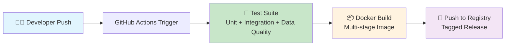

# DataOps CI/CD Pipeline: Automated ETL with GitHub Actions

[](https://github.com/JosephNjiru/dataops-cicd-pipeline-github-actions/actions/workflows/ci-cd.yml)
[](https://www.python.org/downloads/)
[](https://docker.com)
[](LICENSE)

> **Project Status**: ✅ Fully functional. All tests pass in CI/CD and local environments.

This project demonstrates the application of DevOps principles to data engineering through a complete Continuous Integration and Continuous Deployment (CI/CD) pipeline for a serverless ETL job. Leveraging GitHub Actions, it automates testing, validation, and packaging of data transformation code, ensuring robust and reliable data pipelines.

## 🎯 Business Value & Impact

Traditional data engineering workflows often lack automated quality gates, leading to operational risks where untested code changes can disrupt critical data pipelines. This project bridges that gap by implementing **DataOps** practices—applying DevOps methodologies to data engineering.

### Key Achievements
- ✅ **Zero-downtime deployments** with automated testing gates
- ✅ **Data quality assurance** through schema validation
- ✅ **Reproducible environments** via containerization
- ✅ **Rapid iteration** with automated CI/CD workflows
- ✅ **Production-ready artifacts** delivered via Docker images

## 🏗️ Architecture Overview



**Pipeline Flow:**
1. **Code Push** → Triggers automated workflow
2. **Quality Gates** → Comprehensive test suite execution
3. **Artifact Creation** → Docker image build and tagging
4. **Deployment Ready** → Immutable container available for deployment

## 🛠️ Technology Stack

| Component | Technology | Purpose |
|-----------|------------|---------|
| 🏃 **CI/CD** | GitHub Actions | Workflow orchestration and automation |
| 🐍 **Runtime** | Python 3.11+ | ETL application development |
| 🧪 **Testing** | pytest | Unit and integration test framework |
| 📊 **Data Quality** | Pandera | Schema validation and data quality checks |
| 📦 **Containerization** | Docker | Environment reproducibility |
| 🗄️ **Integration Testing** | SQLite | Database testing and validation |
| 📈 **Visualization** | Matplotlib | Pipeline metrics and reporting |

## 📁 Project Structure

```
dataops-cicd-pipeline-github-actions/
├── .github/
│   └── workflows/
│       └── ci-cd.yml              # 🚀 CI/CD pipeline configuration
├── src/
│   └── etl_pipeline/
│       ├── __init__.py
│       └── handler.py             # 🐍 Core ETL logic
├── tests/
│   ├── __init__.py
│   ├── test_handler.py            # ✅ Unit tests
│   ├── test_db_integration.py     # 🗄️ Database integration tests
│   └── test_data_quality.py       # 📊 Data quality validation
├── Dockerfile                     # 📦 Container build instructions
├── requirements.txt               # � Python dependencies
├── generate_paper_charts.py       # 📊 Visualization scripts
└── README.md                      # 📖 Documentation
```

## 🚀 Quick Start

### Prerequisites
- Python 3.11 or higher
- Git
- Docker (for containerized execution)

### Local Development Setup

1. **Clone the repository**
   ```bash
   git clone https://github.com/JosephNjiru/dataops-cicd-pipeline-github-actions.git
   cd dataops-cicd-pipeline-github-actions
   ```

2. **Set up virtual environment**
   ```bash
   # Windows
   python -m venv .venv
   .\.venv\Scripts\activate

   # macOS/Linux
   python3 -m venv .venv
   source .venv/bin/activate
   ```

3. **Install dependencies**
   ```bash
   pip install -r requirements.txt
   ```

4. **Run test suite**
   ```bash
   pytest
   ```

### Docker Execution

Build and run the ETL pipeline in a container:

```bash
# Build the image
docker build -t dataops-etl .

# Run the container
docker run --rm dataops-etl
```

## 📊 Data Quality & Validation

The pipeline implements comprehensive data quality checks using Pandera:

- **Schema Validation**: Enforces data types and constraints
- **Business Rules**: Validates calculated fields (total_price, total_sales)
- **Data Integrity**: Ensures referential integrity and value ranges

```python
# Example: Pandera schema validation
class TransformedSalesSchema(pa.SchemaModel):
    order_id: Series[int] = pa.Field(nullable=False)
    total_price: Series[float] = pa.Field(ge=0, nullable=False)
    # ... additional validations
```

## 📈 Performance Analytics

Generate publication-quality performance visualizations:

```bash
python generate_paper_charts.py
```

**Generated Charts:**
- Pipeline stage duration comparisons
- Data quality validation results
- Statistical distribution of execution times

## 🤝 Contributing

We welcome contributions! Please follow these steps:

1. Fork the repository
2. Create a feature branch (`git checkout -b feature/amazing-feature`)
3. Commit your changes (`git commit -m 'Add amazing feature'`)
4. Push to the branch (`git push origin feature/amazing-feature`)
5. Open a Pull Request

### Development Guidelines
- Ensure all tests pass before submitting PRs
- Follow PEP 8 style guidelines
- Add tests for new functionality
- Update documentation as needed

## 📄 License

This project is licensed under the MIT License - see the [LICENSE](LICENSE) file for details.

## 🙏 Acknowledgments

- Built with ❤️ for the data engineering community
- Inspired by real-world DataOps challenges
- Special thanks to the open-source ecosystem

---

**Ready to revolutionize your data pipelines?** ⭐ Star this repo and join the DataOps movement!
